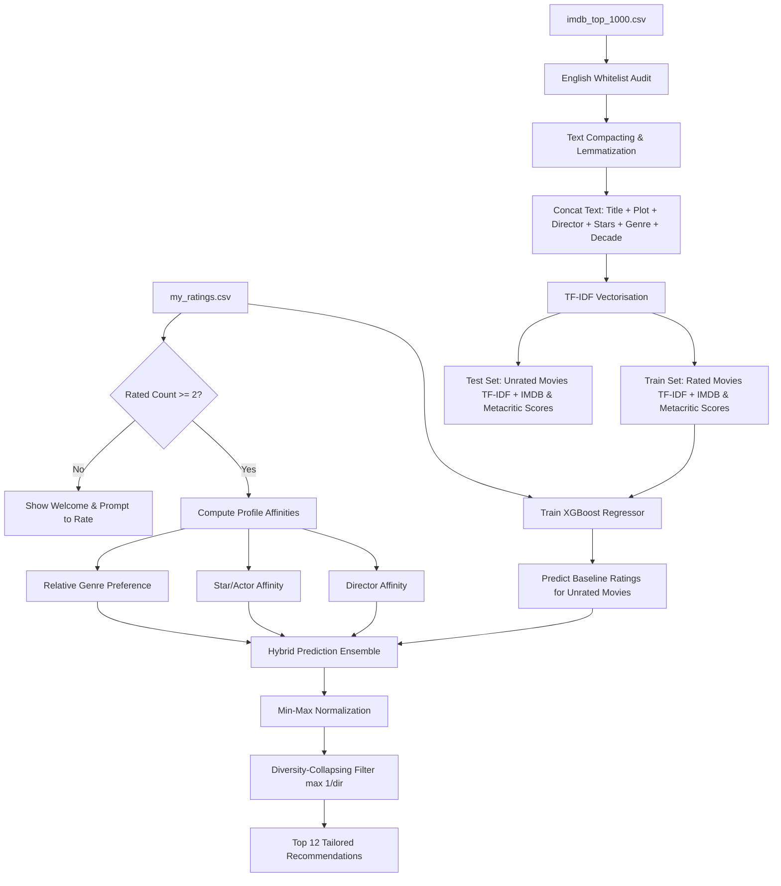

# 🎬 Cinematic Movie Recommender

A premium, hyper-personalized, director-tuned movie recommendation system built with Python, Streamlit, and XGBoost. This system learns from your personal movie ratings to predict match scores, fetching real-time cover art via the OMDb API and presenting recommendations in an immersive glassmorphism card grid.

🔗 **Live Website:** [Streamlit App](https://keshav9926-movie-recommender-app-ofv4l1.streamlit.app/)

---

## 💡 Recommendation Engine Architecture

The core recommendation logic uses a **Hybrid Profile Affinity + Machine Learning Pipeline** designed to mimic real-world taste profiling. Rather than generic bag-of-words recommendations, the system merges advanced Natural Language Processing (NLP), supervised gradient boosting regression, and customized metadata profile affinity boosts.



---

## 📊 Core Concepts Explained

### 1. Vectorisation (TF-IDF)
Computers cannot read text raw; they require numerical representations. **Vectorisation** is the process of converting unstructured textual data (such as movie overviews, genres, and cast lists) into structured numerical vectors.

This project implements the **TF-IDF (Term Frequency-Inverse Document Frequency)** algorithm via scikit-learn's `TfidfVectorizer(max_features=2000, ngram_range=(1, 2))`.

#### The Math Behind TF-IDF:
1. **Term Frequency (TF)** measures how frequently a term $t$ appears in a movie's text document $d$:
   $$\text{TF}(t, d) = \frac{\text{Count of } t \text{ in } d}{\text{Total terms in } d}$$

2. **Inverse Document Frequency (IDF)** measures how unique or informative a term is across the entire catalog of movies $D$. It down-weights common stop-words (like *the*, *and*, *story*) and raises the weight of rare, descriptive terms (like *detective*, *space*, *serial*, *mafia*):
   $$\text{IDF}(t, D) = \log\left(\frac{1 + |D|}{1 + |\{d \in D : t \in d\}|}\right) + 1$$

3. **TF-IDF Weight** is the product of these two values. It yields a high score only if the term is frequent in a specific movie but rare across the entire catalog:
   $$\text{TF-IDF}(t, d, D) = \text{TF}(t, d) \times \text{IDF}(t, D)$$

By setting `ngram_range=(1, 2)`, the model vectorizes both individual words (unigrams) and pairs of adjacent words (bigrams like *science fiction* or *outer space*), capturing crucial context.

---

### 2. Cosine Similarity
**Cosine Similarity** is the standard mathematical metric used to compute how similar two movie profiles are in a high-dimensional vector space.

Even though our pipeline uses an **XGBoost Regressor** to predict ratings directly, Cosine Similarity represents the foundational technique for content-based recommenders (and is imported in `app.py` for similarity calculations).

#### Mathematical Formula:
Given two movie TF-IDF vectors $\vec{A}$ and $\vec{B}$, their cosine similarity is calculated as the cosine of the angle between them:
$$\text{Cosine Similarity}(\vec{A}, \vec{B}) = \cos(\theta) = \frac{\vec{A} \cdot \vec{B}}{\|\vec{A}\| \|\vec{B}\|} = \frac{\sum_{i=1}^{n} A_i B_i}{\sqrt{\sum_{i=1}^{n} A_i^2} \sqrt{\sum_{i=1}^{n} B_i^2}}$$

* **Interpretation**:
  * **$1.0$ (0° angle)**: The movies are perfectly similar in their text descriptors (e.g. sharing identical plot themes, directors, and genres).
  * **$0.0$ (90° angle)**: The movies share absolutely no vocabulary in their vector representation.
  * In a pure content-based recommender, the user's highly rated movies are represented as a unified "User Profile Vector" (typically the average vector of all rated movies), and recommendations are generated by calculating the cosine similarity between the User Vector and all unrated movie vectors.

---

## 🛠️ Step-by-Step Pipeline Execution

When a user opens the app or saves a new rating, the following sequential steps execute:

### Step 1: Text Preprocessing & Token Compacting
* **English Whitelist Filtering**: Restricts films to audited English-only titles (loaded from `english_movies.json`) to satisfy the language whitelist requirement.
* **Score Scaling**: Scales Metacritic ratings down to match the IMDb scale (1-10) and discards entries missing ratings.
* **Token Compacting**: Space-removal is performed on Director and Cast columns (e.g., `Christopher Nolan` $\rightarrow$ `ChristopherNolan`). This ensures that the vectorizer treats names as a single unique token, avoiding matching `Christopher` to unrelated individuals.
* **Decade Indication**: Decades are extracted (e.g., `1990s`) to provide the model with historical context.
* **Document Compilation**: Generates a unified string for each movie:
  $$\text{Document} = \text{Title} + \text{Overview} + \text{Director} + \text{Cast (Stars 1-4)} + \text{Decade} + \text{Genre}$$
* **Lemmatization**: Uses NLTK's `WordNetLemmatizer` to reduce words to their base roots (e.g., `killing`, `killed`, `kills` $\rightarrow$ `kill`), preventing duplicate features.

### Step 2: TF-IDF Feature Extraction
The text documents are fitted into a 2,000-dimensional matrix.
* `X_rated`: TF-IDF matrix for movies the user has rated (training features).
* `X_unrated`: TF-IDF matrix for the remaining unrated movies (prediction target).

### Step 3: User Profile & Affinity Extraction
Before modeling, the engine builds three profile indicators:
1. **Director Affinity**: Average rating for rated movies under each director, scaled by a confidence weight of $\sqrt{\text{count of rated movies by director}}$. This prevents a single high rating from skewing preferences as heavily as a recurring pattern of high ratings.
2. **Star/Actor Affinity**: Average rating across all four cast columns in the rated database.
3. **Relative Genre Preference**: Inspired by TF-IDF, it divides the user's rated genre ratio by the dataset's global prevalence:
   $$\text{Relative Preference Factor} = \frac{\text{User Genre Count} / \text{Total User Rated}}{\text{Global Genre Count} / \text{Total Catalog Count}}$$
   This boosts niche preferences (like *Film-Noir* or *Sci-Fi*) while downweighting ubiquitous categories (like *Drama* or *Comedy*).

### Step 4: XGBoost Regressor Training
* Numeric columns (IMDb rating, Metascore) are combined with the sparse TF-IDF text matrix using `scipy.sparse.hstack`.
* An `XGBRegressor` is trained using a gradient boosted decision tree ensemble with:
  * `objective='reg:squarederror'` (Mean Squared Error minimization)
  * `n_estimators=100` & `learning_rate=0.05`
  * `max_depth=3` (to avoid memorization and overfitting on small ratings profiles)
* The model outputs a baseline prediction `xgb_pred` for every unrated movie.

### Step 5: Hybrid Prediction Ensemble
The final recommendation score combines general content quality predictions with user profile affinities:
$$\text{Final Score} = 0.15 \times \text{xgb\_pred} + 3.8 \times \text{Director Boost} + 0.8 \times \text{Star Boost} + 2.0 \times \text{Genre Boost}$$
* *Note:* All boosts are calculated as deviations from the neutral rating value ($5.0$), allowing negative boosts (penalties) for disliked directors/genres.

### Step 6: Min-Max Normalization
The custom prediction values are normalized back into a friendly star-rating range ($1.0$ to $10.0$):
$$\text{Normalized Score} = 1.0 + 9.0 \times \frac{\text{Score} - \text{Score}_{\text{min}}}{\text{Score}_{\text{max}} - \text{Score}_{\text{min}}}$$

### Step 7: Diversity-Collapsing Filter
To ensure recommendations are diverse, the engine walks down the sorted recommendation list and filters out any movies from directors who already have a movie in the recommendation list. It stops once the top **12** unique director recommendations are identified.

---

## 🎨 Interface Features

* **Glassmorphic Theme**: A dark space-themed background (`#0e111a`) with magenta-pink and orange-yellow neon gradients.
* **Dynamic Cover Art Fetching**: Concurrently queries the OMDb API for high-resolution posters in the background (using a thread pool to avoid slowing down page loads).
* **Interactive Tabs**:
  * **🎯 AI Recommendations**: Instantly generates your Top 12 tailored movies in a responsive two-column grid.
  * **✍️ Rate Movies**: Select any movie to see its poster and overview, adjust your score with a slider, and save/remove ratings.
  * **📋 Rated Catalog**: View a table of all your previously rated films.

---

## 🗂️ Project Structure

```text
movie_recommender/
├── app.py                  # Streamlit application & hybrid recommendation logic
├── english_movies.json     # Whitelisted English-only movie titles catalog
├── imdb_top_1000.csv       # Movie metadata dataset
├── my_ratings.csv          # Local user ratings database
├── web.ipynb               # Model development notebook
├── requirements.txt        # Python library dependencies
└── README.md               # Project documentation
```

---

## 🚀 Run Locally

### 1️⃣ Clone the Repository
```bash
git clone https://github.com/keshav9926/movie_recommender.git
cd movie_recommender
```

### 2️⃣ Set Up Virtual Environment
```bash
# Windows PowerShell
python -m venv venv
venv\Scripts\activate

# macOS / Linux
python -m venv venv
source venv/bin/activate
```

### 3️⃣ Install Dependencies
```bash
pip install -r requirements.txt
```

### 4️⃣ Run the App
```bash
streamlit run app.py
```
*The app will automatically open in your browser at `http://localhost:8501`.*

